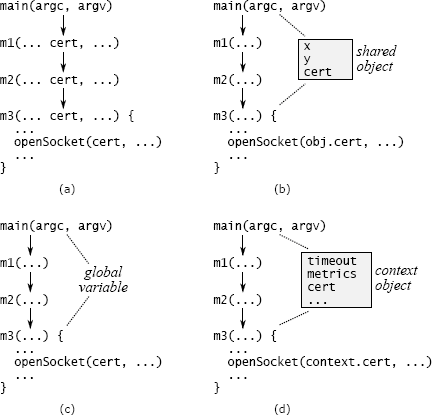

# 第 7 章 不同的层级，不同的抽象

软件系统由不同的层级组成，其中较高的层级使用较低的层级提供的功能。在设计良好的系统中，每一层级都提供与其上下两个层级不同的抽象。如果您通过方法调用来跟踪一个在层级中上下移动的操作，那么抽象会随着每次方法调用而改变。例如：

- 在文件系统中，最上面的层级实现了文件抽象。文件由可变长度的字节数组组成，可以通过读写可变长度的字节范围来更新该文件。文件系统的下一层级在内存中实现了固定大小的磁盘块的高速缓存。调用者可以假定经常使用的块将保留在内存中，以便可以快速访问它们。最底部的层级由设备驱动程序组成，它们在辅助存储设备和内存之间移动数据块。
- 在诸如 TCP 的网络传输协议中，最顶部的层级提供的抽象是从一台机器可靠地传递字节流到另一台机器。这个层级建立在一个更低的层级上，它在机器之间尽最大努力传输有限大小的数据包：大多数数据包会成功传递，但有些数据包可能会丢失或以错误的顺序被传递。

如果系统中包含的相邻层级具有相似的抽象，则这是一个危险信号，表明类的分解存在问题。本章讨论了发生这种情况的场景、导致的问题以及如何重构以消除该问题。

## 7.1 透传方法

当相邻的层级具有相似的抽象时，问题通常以透传方法的形式表现出来。透传方法是一种除了调用有类似或相同签名的另一个方法之外几乎不做任何操作的方法。例如，一个实现图形界面文本编辑器的学生项目包含一个几乎完全由透传方法组成的类。这是该类的摘录：

```java
public class TextDocument ... {
    private TextArea textArea;
    
    private TextDocumentListener listener;
    ...
    public Character getLastTypedCharacter() {
        return textArea.getLastTypedCharacter();
    }
    public int getCursorOffset() {
        return textArea.getCursorOffset();
    }
    public void insertString(String textToInsert, int offset) {
        textArea.insertString(textToInsert, offset);
    }
    public void willInsertString(String stringToInsert, int offset) {
        if (listener != null) {
            listener.willInsertString(this, stringToInsert, offset);
        }
    }
    ...
}
```

该类的 15 个公有方法中，有 13 个是透传方法。

 危险信号：透传方法 

> 透传方法除了将参数传递给另外一个与其有相同 API 的方法外，不执行任何操作。这通常表示相关的类之间没有明确的职责划分。

透传方法使类变得更浅：它们增加了类的接口复杂性，使系统复杂性增加，但是并没有增加系统的整体功能。在上述四个方法中，只有最后一个具有一点功能，虽然也微乎其微：该方法检查了一个变量的有效性。透传方法还会在类之间创建依赖关系：如果 `TextArea` 的 `insertString` 方法更改了签名，则必须更改 `TextDocument` 中的 `insertString` 方法以进行匹配。

透传方法表明类之间的责任划分存在混淆。在上面的示例中，`TextDocument` 类提供了 `insertString` 方法，但是用于插入文本的功能完全在 `TextArea` 中实现。这通常是一个坏主意：某个功能的接口应该在实现该功能的同一个类中。当您看到从一个类到另一个类的透传方法时，请考虑这两个类，并问自己：这些类分别负责哪些功能和抽象？您将可能会注意到这些类之间的职责重叠。

解决方案是重构这些类，以使每个类都有各自不同且连贯的职责。图 7.1 说明了几种方法。一种方法，如图 7.1（b）所示，是将较低层级的类直接暴露给较高层级的类的调用者，而从较高层级的类中移除对该功能的所有责任。另一种方法是在类之间重新分配功能，如图 7.1（c）所示。最后，如果无法解开这些类，最好的解决方案可能是如图 7.1（d）所示合并它们。


图 7.1：透传方法。在（a）中，类 C1 包含三个透传方法，这些方法只调用 C2 中具有相同签名的方法（每个符号代表一个特定的方法签名）。可以像在（b）中那样使 C1 的调用方直接调用 C2，或者像在 (c) 中那样在 C1 和 C2 之间重新分配功能以避免这两个类之间的调用，或者像在 (d) 中那样将这两个类组合起来，以消除透传方法。

在上面的示例中，职责交织的三个类为：TextDocument、TextArea 和 TextDocumentListener。这次学生通过在类之间移动方法并将三个类缩减为两个类来消除透传方法，而这两个类的职责也变得更加明确。

## 7.2 什么时候可以有重复的接口？

具有相同签名的方法并不总是不好的。重要的是，每种新方法都应贡献重要的功能。透传方法很糟糕是因为它们不提供任何新功能。

一个方法调用另一个具有相同签名的方法的有用的例子是分发器（Dispatcher）。分发器也是一个方法，它基于自己接收到的参数从其他几个方法中选择一个来调用，并将其大部分或全部参数传递给选定的方法。分发器的签名通常与其调用的方法的签名相同。尽管如此，分发器还是提供了有用的功能：它从其他几个方法中选择了一个来执行任务。

例如，当 Web 服务器从 Web 浏览器接收到传入的 HTTP 请求时，它将调用一个分发器来检查传入请求中的 URL 并选择一种特定的方法来处理该请求。某些 URL 可以通过返回磁盘上文件的内容来处理；其他的则可能通过调用诸如 PHP 或 JavaScript 之类的语言的程序来处理。分发过程可能非常复杂，通常由与传入 URL 匹配的一组规则来驱动。

只要每个方法都提供了有用且独特的功能，几个方法都具有相同的签名是可以接受的。分发器调用的方法就具有此属性。另一个示例是具有多种实现的接口，例如操作系统中的磁盘驱动程序。每个驱动程序都支持不同类型的磁盘，但是它们都有相同的接口。当几个方法提供了同一接口的不同实现时，它将减少认知负荷。只要使用过其中一个方法，也就更容易使用其他的方法，因为您无需学习新的接口。像这样的方法通常位于同一层级，并且它们不会相互调用。

## 7.3 装饰器

装饰器设计模式（也称为“包装器”）是一种鼓励跨层级 API 复制的模式。装饰对象接受一个现有对象并扩展其功能，它提供了一个与底层对象相似或相同的 API，它的方法会调用底层对象的方法。在[第 4 章](ch04.md)的 Java I/O 示例中，`BufferedInputStream` 类就是一个装饰器：给定一个 `InputStream` 对象，它提供了相同的 API，但是引入了缓冲。例如，当它的 `read` 方法被调用来读取单个字符时，它会调用底层 `InputStream` 上的 `read` 来读取更大的块，并保存额外的字符来满足未来的 `read` 调用。另一个例子出现在窗口系统中：`Window` 类实现了一个不能滚动的窗口的简单形式，而 `ScrollableWindow` 类通过添加水平和垂直滚动条来装饰窗口类。

装饰器的动机是将类的专用扩展与更通用的核心功能分开。但是，装饰器类往往很浅：它们引入了大量的样板以实现少量的新功能。装饰器类通常包含许多透传方法。过度使用装饰器模式很容易，只要为每个小的新功能都创建一个新的类。这将导致诸如 Java I/O 示例的浅类激增。

创建装饰器类之前，请考虑以下替代方法：

- 您能否将新功能直接添加到基础类，而不是创建装饰器类？如果新功能是相对通用的，或者在逻辑上与基础类相关，或者如果使用基础类的大多数时候也将使用新功能，则这是有意义的。例如，几乎每个创建 Java `InputStream` 的人都会创建一个 `BufferedInputStream`，并且缓冲是 I/O 的自然组成部分，因此应该合并这些类。
- 如果新功能专用于特定用例，将其与用例合并而不是创建单独的类是否更有意义？
- 您可以将新功能与现有的装饰器合并，而不是创建新的装饰器吗？这将产生一个更深的装饰器类，而不是多个浅的装饰器类。
- 最后，问问自己新功能是否真的需要包装现有功能：是否可以将其实现为独立于基础类的独立类？在窗口示例中，滚动条可能可以与主窗口分开实现，而无需包装其所有的现有功能。

包装器有时是有意义的。一个例子是，当系统使用了一个外部类，并且该类的接口不能被修改，但该类必须符合使用它的应用程序中的不同接口。在这种情况下，可以使用包装器类来翻译接口。然而，这种情况很少发生，通常会有比使用包装器类更好的选择。

## 7.4 接口与实现

“不同的层级，不同的抽象”规则的另一个应用是，类的接口通常应与其实现不同：内部使用的表示形式应与接口中出现的抽象形式不同。如果两者具有相似的抽象，则该类可能不是很深。例如，在[第 6 章](ch06.md)讨论的文本编辑器项目中，大多数团队都以文本行的形式实现了文本模块，每行分别存储。一些团队还使用 getLine 和 putLine 之类的方法围绕行设计了文本类的 API。但是，这使文本类使用起来较浅且笨拙。在较高层级的用户界面代码中，在行中间插入文本（例如，当用户键入内容时）或删除跨行的文本范围都是很常见的。基于文本类的面向行的 API，调用者被迫拆分和连接行以实现用户界面操作。这些代码并不简单，并且会在用户界面的实现中被到处复制和散布。

当文本类提供的是面向字符的接口时，使用起来要容易得多，例如，insert 方法可在文本的任意位置插入任意文本字符串（可能包括换行符），而 delete 方法则可以在文本中的两个任意位置之间删除文本。在内部，文本仍以行表示。面向字符的接口封装了文本类内部的行拆分和连接的复杂性，这使文本类更深，并简化了使用该类的高层级代码。通过这种方法，文本 API 与面向行的存储机制大不相同，这个差异也表示该类提供了有价值的功能。

## 7.5 透传变量

跨层级 API 重复的另一种形式是透传变量，该变量是通过一长串方法向下传递的变量。图 7.2（a）显示了一个数据中心服务的示例。命令行参数描述用于安全通信的证书。只有底层方法 `m3` 才需要此信息，该方法调用一个库方法来打开套接字，但是该信息会通过 `main` 和 `m3` 之间路径上的所有方法向下传递。`cert` 变量出现在每个中间方法的签名中。

透传变量增加了复杂性，因为它们强迫所有中间方法知道它们的存在，即使这些变量对这些中间方法没有用处。此外，如果存在一个新变量（例如，最初构建的系统不支持证书，但是您后来决定添加该支持），则可能必须修改大量的接口和方法才能将变量传递给所有相关路径。

消除透传变量可能是有挑战性的。一种方法是查看最顶层和最底层方法之间是否已共享对象。在图 7.2 的数据中心服务示例中，也许存在一个对象，其中包含有关网络通信的其他信息，并且对于 `main` 和 `m3` 都是可用的。如果是这样，`main` 可以将证书信息存储在该对象中，因此不必通过通往 `m3` 的路径上的所有中间方法来传递证书（请参见图 7.2（b））。但是，如果存在这样的对象，则它本身可能是传递变量（否则 `m3` 如何能访问到它？）。

另一种方法是将信息存储在全局变量中，如图 7.2（c）所示。这避免了将信息从一个方法传递到另一个方法的需要，但是全局变量几乎总是会产生其他问题。例如，在同一进程中无法创建同一系统的两个独立的全局变量，所以对全局变量的访问会发生冲突。虽然在生产中似乎不太可能需要多个实例，但是它们通常在测试中很有用。

我最常使用的解决方案是引入一个上下文（Context）对象，如图 7.2（d）所示。上下文存储应用程序的所有全局状态（否则将只能是透传变量或全局变量的任何状态）。大多数应用程序在其全局状态下具有多个变量，这些变量表示诸如配置选项、共享的子系统和性能计数器之类的内容。每个系统实例只有一个上下文对象。上下文允许系统的多个实例在单个进程中共存，每个实例都有自己的上下文。



图 7.2：处理透传变量的可能技术。在（a）中，证书通过方法 `m1` 和 `m2` 传递，即使它们并不使用它。在（b）中，`main` 和 `m3` 具有对一个对象的共享访问权，因此可以将变量存储在此处，而不用将其传递给 `m1` 和 `m2`。在（c）中，证书存储为全局变量。在（d）中，证书与其他系统范围的信息（例如超时值和性能计数器）一起存储在上下文对象中；对上下文的引用存储在其方法需要访问它的所有对象中。

不幸的是，在许多地方可能都需要上下文，因此它有可能成为透传变量。为了减少必须知道上下文存在的方法数量，可以将上下文的引用保存在系统的大多数主要对象中。在图 7.2（d）的示例中，包含 `m3` 的类将对上下文的引用作为实例变量存储在其对象中。创建新对象时，创建方法将从其对象中取得上下文的引用，并将其传递给新对象的构造函数。使用这种方法，上下文随处可用，但仅在构造函数中作为显式参数出现。

上下文对象统一了所有系统全局信息的处理，并且不需要透传变量。如果需要添加新变量，则可以将其添加到上下文对象中；除了上下文的构造函数和析构函数外，现有代码均不受影响。由于上下文全部存储在一个位置，因此可以轻松识别和管理系统的全局状态。上下文也便于测试：测试代码可以通过修改上下文中的字段来更改应用程序的全局配置。如果系统使用透传变量，则实施此类更改将更加困难。

上下文远非理想的解决方案。存储在上下文中的变量具有全局变量的大多数缺点。例如，为什么存在特定变量或在何处使用特定变量可能并不明显。如果不加以必要的管理，上下文会变成巨大的数据混杂包，从而在整个系统中创建不明显的依赖关系。上下文也可能产生线程安全问题；避免问题的最佳方法是使上下文中的变量不可变。不幸的是，我没有找到比上下文更好的解决方案。

## 7.6 结论

添加到系统中的每一个设计元素，如接口、参数、函数、类或定义，都会增加复杂性，因为开发人员必须了解这个元素。为了使一个设计元素在对抗复杂性时产生净收益，它必须消除那些在没有该设计元素时出现的复杂性 。否则，您最好在没有该特定元素的情况下实现您的系统。例如，一个类可以通过封装功能来降低复杂性，这样该类的用户就不必知道这些具体的功能实现了。

“不同的层级，不同的抽象”规则只是一种思想的应用：如果不同的层级具有相同的抽象，例如透传方法或装饰器，则很有可能它们没有提供足够的收益来弥补它们所增加的元素。类似地，透传参数要求所有相关方法都知道它们的存在（这增加了复杂性），而又没有贡献额外的功能。
